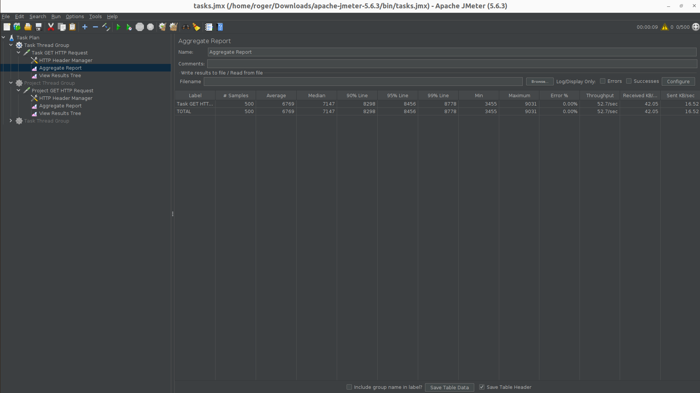
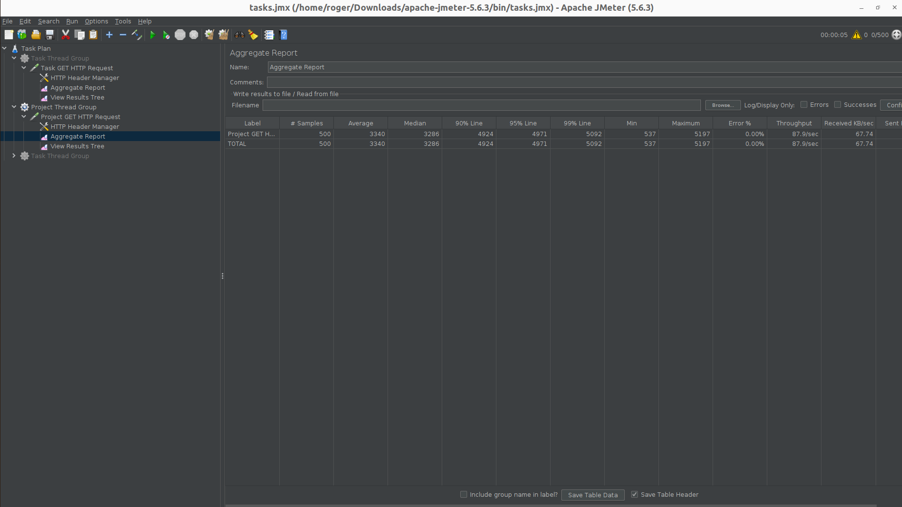
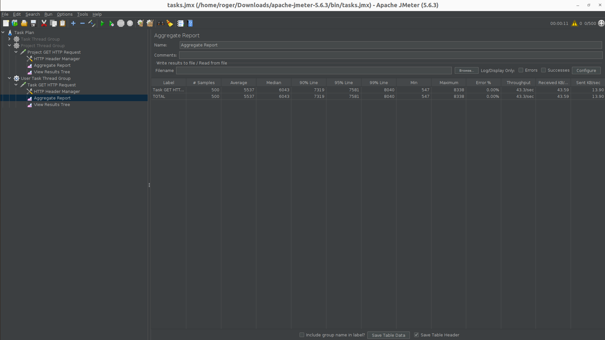
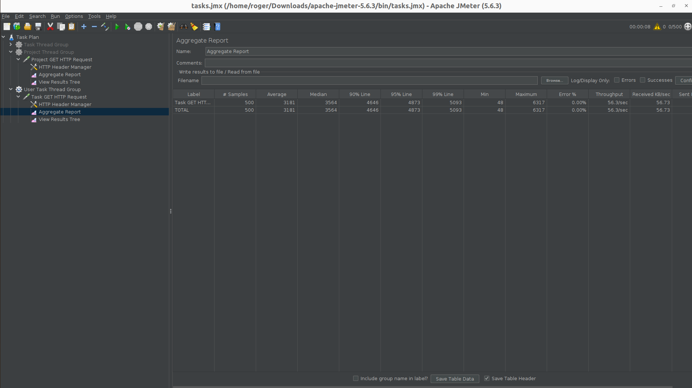
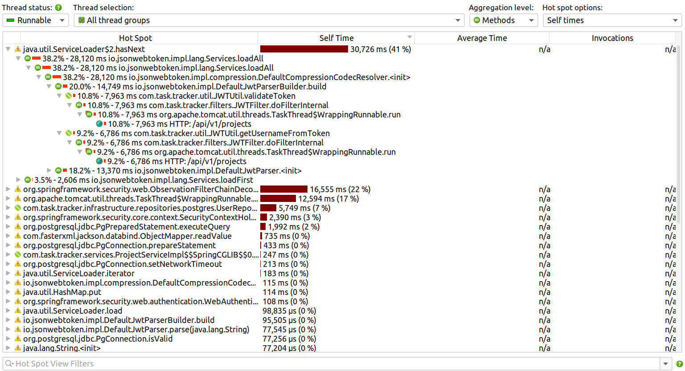
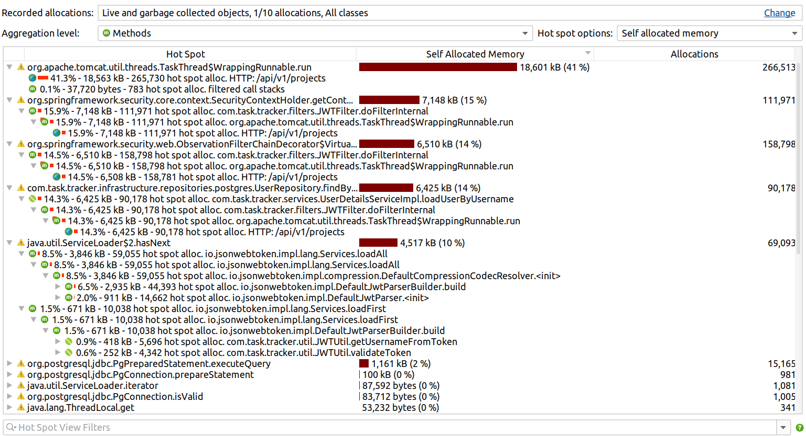
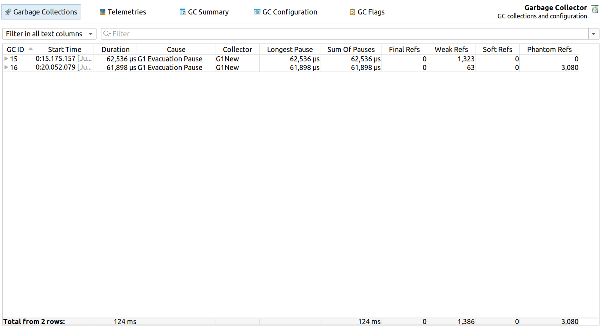
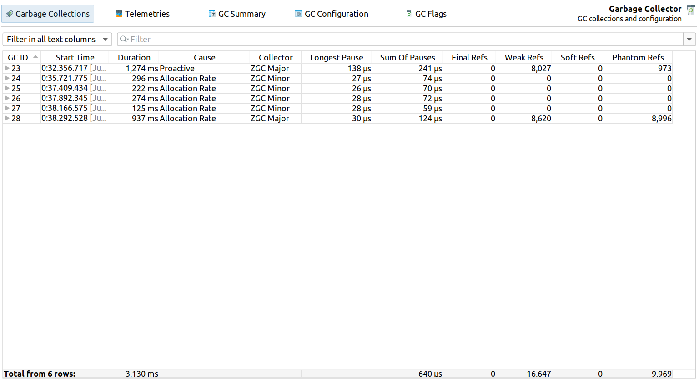
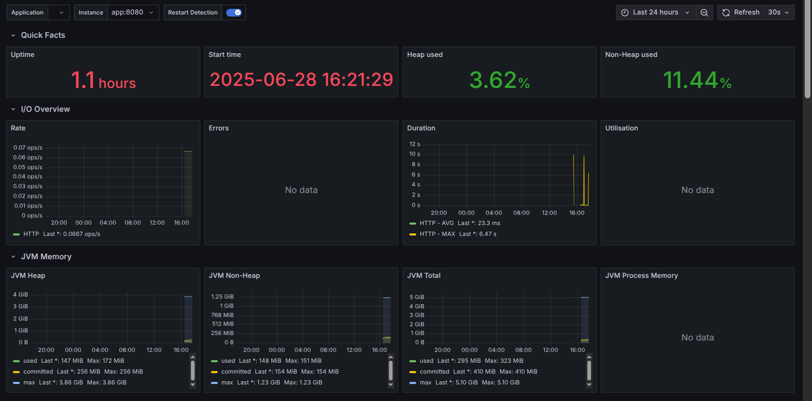
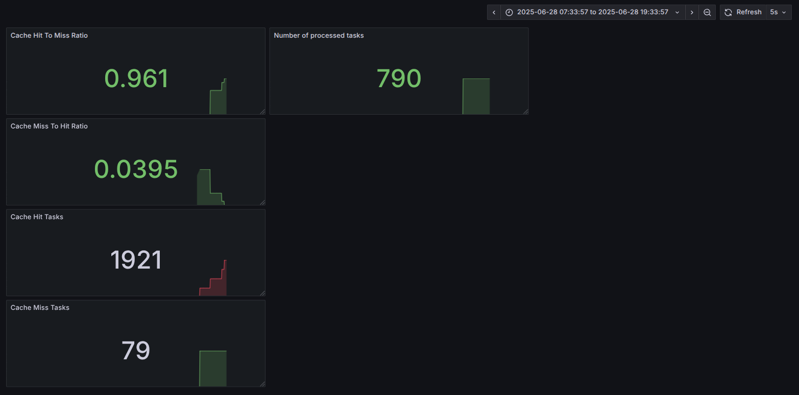

# Tracker Boost

# Initial Profiling

## Test Overview
- **Tool**: Apache JMeter 5.6.3

1. ## Test Plan:

Task Thread Group with HTTP requests

| Metric | Value | Unit |
|--------|-------|------|
| **Samples** | 500 | requests |
| **Average Response Time** | 12,296 | ms |
| **Median Response Time** | 12,877 | ms |
| **90% Line** | 16,538 | ms |
| **95% Line** | 16,671 | ms |
| **99% Line** | 16,834 | ms |
| **Min Response Time** | 5,467 | ms |
| **Max Response Time** | 16,925 | ms |
| **Error Rate** | 0.00% | % |
| **Throughput** | 28.8 | req/sec |
| **Received KB/sec** | 28.78 | KB/s |
| **Sent KB/sec** | 8.95 | KB/s |

### Initial Performance Issues
The profiling results highlight some serious performance issues. Response times are far too high. Throughput is also very low at just 28.8 requests per second, suggesting the system is hitting its resource limits. The high latency range (16.5 to 16.9 seconds), which points to inefficient database queries, connection pool limits making it for the system to deliver a good experience.

### Optimizations

| Metric | Value | Unit |
|--------|-------|------|
| **Samples** | 500 | requests |
| **Average Response Time** | 6,769 | ms |
| **Median Response Time** | 7,147 | ms |
| **90% Line** | 8,298 | ms |
| **95% Line** | 8,456 | ms |
| **99% Line** | 8,778 | ms |
| **Min Response Time** | 3,455 | ms |
| **Max Response Time** | 9,031 | ms |
| **Error Rate** | 0.00% | % |
| **Throughput** | 52.7 | req/sec |
| **Received KB/sec** | 42.05 | KB/s |
| **Sent KB/sec** | 16.52 | KB/s |

### Performance Improvement Analysis

| Metric | Before | After | Improvement | % Change |
|--------|--------|-------|---------|----------|
| **Average** | 12,296ms | 6,769ms | 5,527ms | **45.0%** |
| **Median** | 12,877ms | 7,147ms | 5,730ms | **44.5%** |
| **90th Percentile** | 16,538ms | 8,298ms | 8,240ms | **49.8%** |
| **95th Percentile** | 16,671ms | 8,456ms | 8,215ms | **49.3%** |
| **99th Percentile** | 16,834ms | 8,778ms | 8,056ms | **47.8%** |
| **Min Response** | 5,467ms | 3,455ms | 2,012ms | **36.8%** |
| **Max Response** | 16,925ms | 9,031ms | 7,894ms | **46.6%** |

Optimizations like pagination, caching and response size reduction significantly improved performance—cutting latency by nearly 50% and boosting throughput by 83%.

2. ## Project Plan
Initial requests data without optimizations:

| Metric | Value | Unit |
|--------|-------|------|
| **Samples** | 500 | requests |
| **Average Response Time** | 7,076 | ms |
| **Median Response Time** | 7,570 | ms |
| **90% Line** | 10,166 | ms |
| **95% Line** | 10,285 | ms |
| **99% Line** | 10,368 | ms |
| **Min Response Time** | 67 | ms |
| **Max Response Time** | 10,439 | ms |
| **Error Rate** | 0.00% | % |
| **Throughput** | 44.8 | req/sec |
| **Received KB/sec** | 46.73 | KB/s |

###  Initial Performance Issues

The baseline metrics revealed critical performance limitations: excessive latency (7.1s average, 10.2s at 90th percentile), constrained throughput (44.8 req/sec), and instability (max latency 10.4s), collectively demonstrating severe backend issues such as unoptimized queries and a lack of caching mechanisms.

### Optimizations

| Metric | Value | Unit |
|--------|-------|------|
| **Samples** | 500 | requests |
| **Average Response Time** | 3,340 | ms |
| **Median Response Time** | 3,286 | ms |
| **90% Line** | 4,924 | ms |
| **95% Line** | 4,971 | ms |
| **99% Line** | 5,092 | ms |
| **Min Response Time** | 537 | ms |
| **Max Response Time** | 5,197 | ms |
| **Error Rate** | 0.00% | % |
| **Throughput** | 87.9 | req/sec |
| **Received KB/sec** | 87.74 | KB/s |

### Performance Improvement Analysis

| Metric | After | Before | Difference | % Change |
|--------|--------|--------|------------|----------|
| **Average** | 3,340ms | 7,076ms | +3,736ms | **+111.9%** |
| **Median** | 3,286ms | 7,570ms | +4,284ms | **+130.4%** |
| **90th Percentile** | 4,924ms | 10,166ms | +5,242ms | **+106.5%** |
| **95th Percentile** | 4,971ms | 10,285ms | +5,314ms | **+106.9%** |
| **99th Percentile** | 5,092ms | 10,368ms | +5,276ms | **+103.6%** |
| **Min Response** | 537ms | 67ms | -470ms | **-87.5%** |
| **Max Response** | 5,197ms | 10,439ms | +5,242ms | **+100.8%** |

Optimization techniques such as caching, pagination  and response payload minimization were  used to alleviate pressure on the backend.

3. ## User Plans
User Task Thread Group with HTTP requests

| Metric | Value |
|--------|-------|
| Samples | 500 |
| Average (ms) | 5537 |
| Median (ms) | 6043 |
| 90% Line (ms) | 7319 |
| 95% Line (ms) | 7501 |
| 99% Line (ms) | 8040 |
| Min (ms) | 547 |
| Max (ms) | 8338 |
| Error % | 0.00% |
| Throughput (/sec) | 43.3 |
| Received KB/sec | 43.59 |

### Initial Performance Issues

The metrics reveal significant bottlenecks in response time and consistency. With an average response time of 5537 ms and 99th percentile at 8040 ms, the system is indicates substantial latency, most likely due to backend processing delays and thread contention. The wide gap between the minimum (547 ms) and maximum (8338 ms) response times indicates inconsistent performance under load pointing to a need for performance tuning and optimization.

### Optimizations

| Metric | Value |
|--------|-------|
| Samples | 500 |
| Average (ms) | 3181 |
| Median (ms) | 3564 |
| 90% Line (ms) | 4646 |
| 95% Line (ms) | 4873 |
| 99% Line (ms) | 5093 |
| Min (ms) | 48 |
| Max (ms) | 6317 |
| Error % | 0.00% |
| Throughput (/sec) | 56.3 |
| Received KB/sec | 56.73 |

### Performance Optimization Results

| Metric | Baseline  | Optimized | Improvement | % Improvement |
|--------|-------------------|-------------------|-------------|---------------|
| Average Response Time (ms) | 5,537 | 3,181 | 2,356 | **42.5%** |
| Median Response Time (ms) | 6,043 | 3,564 | 2,479 | **41.0%** |
| 90% Line (ms) | 7,319 | 4,646 | 2,673 | **36.5%** |
| 95% Line (ms) | 7,501 | 4,873 | 2,628 | **35.0%** |
| 99% Line (ms) | 8,040 | 5,093 | 2,947 | **36.6%** |
| Min Response Time (ms) | 547 | 48 | 499 | **91.2%** |
| Max Response Time (ms) | 8,338 | 6,317 | 2,021 | **24.2%** |
| Throughput (/sec) | 43.3 | 56.3 | 13.0 | **30.0%** |
| Data Transfer Rate (KB/sec) | 43.59 | 56.73 | 13.14 | **30.1%** |

Again using optimization techniques such as caching, pagination and response payload minimization were used to alleviate pressure on the backend, resulting in improved performance.

## CPU and Memory Hotspots
For this section all the endpoints demonstrate similar behaviour emerging from the same set of classes and method with the JWT token verification, user details and other security related processes in conjunction with data retrieval from the database playing a major role.
The most notable difference is the endpoint and the table the data is being retrieved from.

## G1 collector vs ZGC collector

### Tasks Endpoint as Sample

### G1GC Performance
- **Collection Period**: IDs 15-16
- **Total Collections**: 2 events
- **Collector Type**: G1New (G1 Garbage Collector)
- **Total Duration**: 124ms
- **Collection Cause**: G1 Evacuation Pause

### ZGC Performance
- **Collection Period**: IDs 23-28
- **Total Collections**: 6 events
- **Collector Type**: ZGC (Z Garbage Collector)
- **Total Duration**: 3,130ms
- **Collection Causes**: Allocation Rate, Proactive

### Detailed Performance Metrics

### Duration Analysis

#### G1GC Collection Durations
| GC ID | Duration | Cause | Consistency |
|-------|----------|-------|-------------|
| 15 | 62,536 μs (~62.5ms) | G1 Evacuation Pause | Very consistent |
| 16 | 61,898 μs (~61.9ms) | G1 Evacuation Pause | timing |

**Average Duration**: 62,217 μs (62.2ms)

#### ZGC Collection Durations
| GC ID | Duration | Type | Cause |
|-------|----------|------|-------|
| 23 | 1,274ms | ZGC Major | Proactive |
| 24 | 296ms | ZGC Minor | Allocation Rate |
| 25 | 227ms | ZGC Minor | Allocation Rate |
| 26 | 274ms | ZGC Minor | Allocation Rate |
| 27 | 125ms | ZGC Minor | Allocation Rate |
| 28 | 937ms | ZGC Major | Allocation Rate |

**Performance Patterns**:
- Minor collections: 125-296ms
- Major collections: 937-1,274ms
- High variability based on collection type

### Performance Metrics Summary

| Metric | G1GC | ZGC | ZGC Advantage |
|--------|------|-----|---------------|
| Average Pause Time | 62,217μs | 85μs | **99.86% lower** |
| Total Collection Time | 124ms | 3,130ms | G1GC 96% lower |
| Pause Predictability | High | High | Tie |
| Concurrent Operation | No | Yes | ZGC advantage |
| Reference Processing | Moderate | High | Variable |

### Conclusion

The choice between G1GC and ZGC is a trade-off between **total throughput** and **latency consistency**. G1GC delivers superior total performance with 96% lower collection overhead, making it ideal for batch processing and throughput-oriented applications. ZGC excels in latency-critical scenarios with 99.86% lower pause times, making it perfect for real-time applications where consistent response times are paramount.

The data reveals that neither collector is universally superior and the optimal choice depends entirely on application requirements, infrastructure constraints, and performance priorities.

## Basic and Custom Metrics
The following is a set metrics collected from the tracker application that consists of 
both custom data and basic system data. 
To use the grafana dashboards run the docker compose version of the application.

### Basic Metrics

### Custom Data
1. Number of Tasks Processed and Cache Metrics

## Observations
Using the same environment to run the application and to test it simultaneously leads to
inconsistencies in metric dat, especially when attaching jprofiler. These processes compete
for system resources leading to these inconsistent data.
Reference: https://www.ej-technologies.com/resources/jprofiler/help/doc/main/profiling.html

