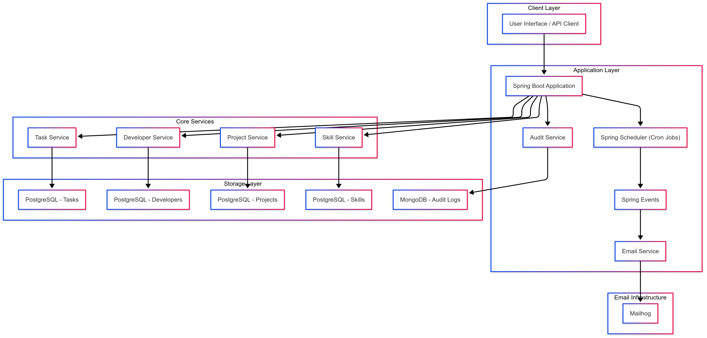
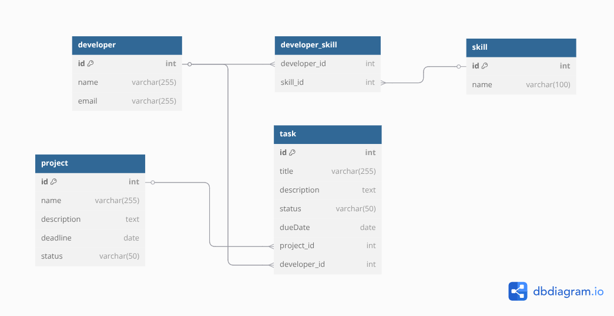
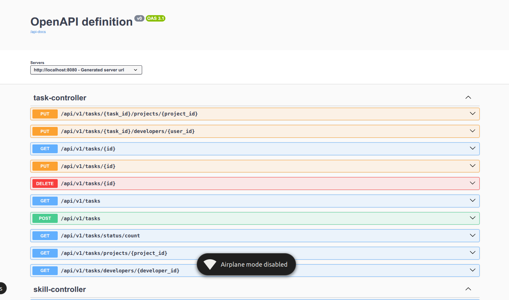

# Project Tracker Rest API

## Overview
This is a Spring Boot application that provides a RESTful API for managing tasks, developers, projects, and skills, with audit logging and email notifications. The application is built with a layered architecture, using **Spring Data MongoDB** for audit logs, **PostgreSQL** for core data storage, and **Springdoc OpenAPI** for interactive API documentation via Swagger UI. It includes scheduled tasks, event-driven email notifications, and a modular service layer.

## Architecture
The application follows a layered architecture, as depicted in the following Mermaid flowchart:



### Architecture Layers
- **Client Layer**: External clients (e.g., UI or API clients) interact with the application via REST endpoints.
- **Application Layer**: The Spring Boot application handles incoming requests, coordinates services, runs scheduled tasks (via Spring Scheduler), triggers events (Spring Events), and manages email notifications and audit logging.
- **Core Services**: Modular services (`TaskService`, `DevService`, `ProjectService`, `SkillService`) encapsulate business logic for managing tasks, developers, projects, and skills.
- **Storage Layer**: Persistent storage using **PostgreSQL** for tasks, developers, projects, and skills, and **MongoDB** for audit logs.
- **Email Infrastructure**: **Mailhog** is used for testing email notifications triggered by Spring Events.

## Features
- REST API to manage tasks, developers, projects, and skills.
- Query audit logs by field actorName (e.g., `GET /audit_logs/{actorName}`) using MongoDB.
- Event-driven email notifications using Spring Events and Mailhog.
- Interactive API documentation via Swagger UI.
- Modular and scalable service-based architecture.

## Prerequisites
- **Java**: 17 or later
- **Maven**: 3.6.0 or later
- **PostgreSQL**: 13 or later
- **MongoDB**: 4.4 or later (local or MongoDB Atlas)
- **Mailhog**: For local email testing
- **Spring Boot**: 3.x (or 2.x with compatible Springdoc version)
- IDE (e.g., IntelliJ IDEA, Eclipse) or command-line tools

## Setup Instructions

### 1. Clone the Repository
```bash
https://github.com/myspace20/tracker
cd tracker
```

### 2. Configure Databases
- **PostgreSQL**:
  - Set up a PostgreSQL instance (local or cloud).
  - Create databases for tasks, developers, projects, and skills (e.g., `tasks_db`, `devs_db`, `projects_db`, `skills_db`).
  - Update `src/main/resources/application.properties`:
    ```properties
    spring.datasource.url=jdbc:postgresql://localhost:5432/tasks_db
    spring.datasource.username=postgres
    spring.datasource.password=your_password
    spring.jpa.hibernate.ddl-auto=update
    ```
    Repeat for other PostgreSQL databases or use a single database with different tables.

- **MongoDB**:
  - Ensure MongoDB is running locally or via MongoDB Atlas.
  - Configure the connection in `application.properties`:
    ```properties
    spring.data.mongodb.uri=mongodb://localhost:27017/audit_db
    ```
  
  **ERD**




### 3. Configure Mailhog
- Install and run Mailhog locally for email testing:
  ```bash
  docker run -d -p 1025:1025 -p 8025:8025 mailhog/mailhog
  ```
- Update email settings in `application.properties`:
  ```properties
  spring.mail.host=localhost
  spring.mail.port=1025
  spring.mail.username=
  spring.mail.password=
  ```

### 4. Install Dependencies
```bash
./gradlew clean build
```

### 5. Configure Swagger UI
Swagger UI is enabled via Springdoc OpenAPI. Verify settings in `application.properties`:
```properties
springdoc.swagger-ui.enabled=true
springdoc.swagger-ui.path=/swagger-ui
springdoc.api-docs.path=/api-docs
springdoc.info.title=Task Management API
springdoc.info.description=API for managing tasks, developers, projects, skills, and audit logs
springdoc.info.version=1.0.0
```

***Sample Endpoints***




### 6. Run the Application
```bash
./gradlew bootRun or docker compose up( if you prefer)
```

### 7. Access the Application
- **Swagger UI**: `http://localhost:8080/swagger-ui.html`
- **API Endpoints**: Example: `curl http://localhost:8080/api/v1/**`
- **Mailhog UI**: `http://localhost:8025` (to view sent emails)

## API Endpoints
### Audit Log Example
- **GET /audit_logs/:actorName**
  - **Description**: Retrieve audit logs by event type from MongoDB.
  - **Parameters**: `actorName` (path variable, e.g., `actorName`).
  - **Response**:
    - `200 OK`: List of audit logs.
    - `404 Not Found`: No logs found.
    - `500 Internal Server Error`: Server issue.
  - **Example**:
    ```bash
    curl http://localhost:8080/audit_logs/:Roger
    ```
    Response:
    ```json
    [
      {
        "id": "1",
        "eventType": "USER_LOGIN",
        "timestamp": "2025-06-07T20:13:31.875"
      }
    ]
    ```

### Other Endpoints
- `GET /tasks`: Retrieve tasks (PostgreSQL).
- `GET /developers`: Retrieve developers (PostgreSQL).
- `GET /projects`: Retrieve projects (PostgreSQL).
- `GET /skills`: Retrieve skills (PostgreSQL).
(Additional endpoints can be added based on your services.)

## Project Structure
```
src/
├── main/
│   ├── java/com/tracker/
│   │   ├── TrackerApplication.java       
│   │   ├── models/                    
│   │   ├── repository/               
│   │   ├── service/                  
│   │   ├── controller/ 
│   │   ├── mappers/                    
│   │   ├── exceptions/                    
│   │   ├── util/                    
│   │   ├── dto/                    
│   │   ├── events/ 
│   │   ├── config/                    
│   ├── resources/
│   │   ├── application.properties     
```

## Dependencies
```
dependencies {
    implementation 'org.springframework.boot:spring-boot-starter-web'
    implementation 'org.springframework.boot:spring-boot-starter-data-mongodb'
    implementation 'org.springframework.boot:spring-boot-starter-data-jpa'
    implementation 'org.postgresql:postgresql'
    implementation 'org.springframework.boot:spring-boot-starter-mail'
    implementation 'org.springdoc:springdoc-openapi-starter-webmvc-ui:2.6.0'
}

```

## Troubleshooting
- **Swagger UI Error ("No static resource swagger-ui")**:
  - Verify `springdoc-openapi-starter-webmvc-ui` dependency.
  - Access `http://localhost:8080/swagger-ui.html` (not `/swagger-ui` unless customized).
  - Remove conflicting dependencies (e.g., Springfox).
  - Enable debug logging:
    ```properties
    logging.level.org.springdoc=DEBUG
    ```
- **Database Connection Issues**:
  - Ensure PostgreSQL and MongoDB are running.
  - Verify connection strings in `application.properties`.
- **Mailhog Issues**:
  - Confirm Mailhog is running (`http://localhost:8025`).
  - Check email configuration in `application.properties`.
- **Scheduler/Event Issues**:
  - Ensure `@EnableScheduling` is added to the main application class.
  - Verify event listeners are configured for Spring Events.


## Contributing
- Fork the repository.
- Create a feature branch (`git checkout -b feature/new-feature`).
- Commit changes (`git commit -m "Add new feature"`).
- Push to the branch (`git push origin feature/new-feature`).
- Open a pull request.

